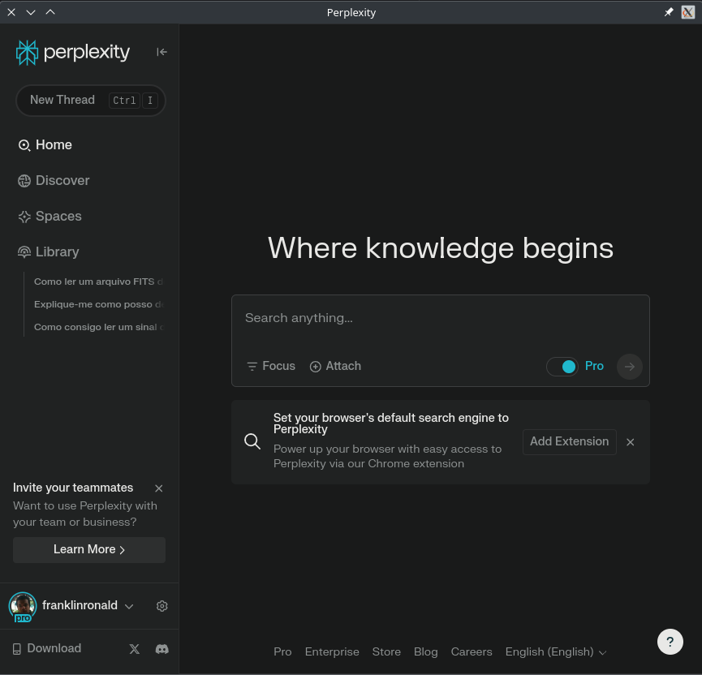

  

<h1 align="center">🚀 Simplexity - The simple Perplexity AI Desktop App</h1>

---

  The non-nonsense simple desktop app for Perplexity AI. It's just work, no magic, no tray, no scripts injected and nothing obfuscated.

  

---

## ✨ Features

- **Just works**: Open Perplexity and is just it.
- **Persistent window state**: If the window is on primary display, stay on primary. If the window is small, stay small. Simple.
- **No magical tray**: Why still running? Just open when you want and close when you want.

---

## 📦 Releases

Download the latest releases for Linux on [releases section](https://github.com/Wiselabs/simplexity/releases).

## 🗃️ License

This project is licensed under the BSD3 License.

---